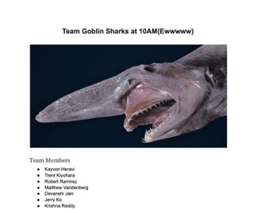
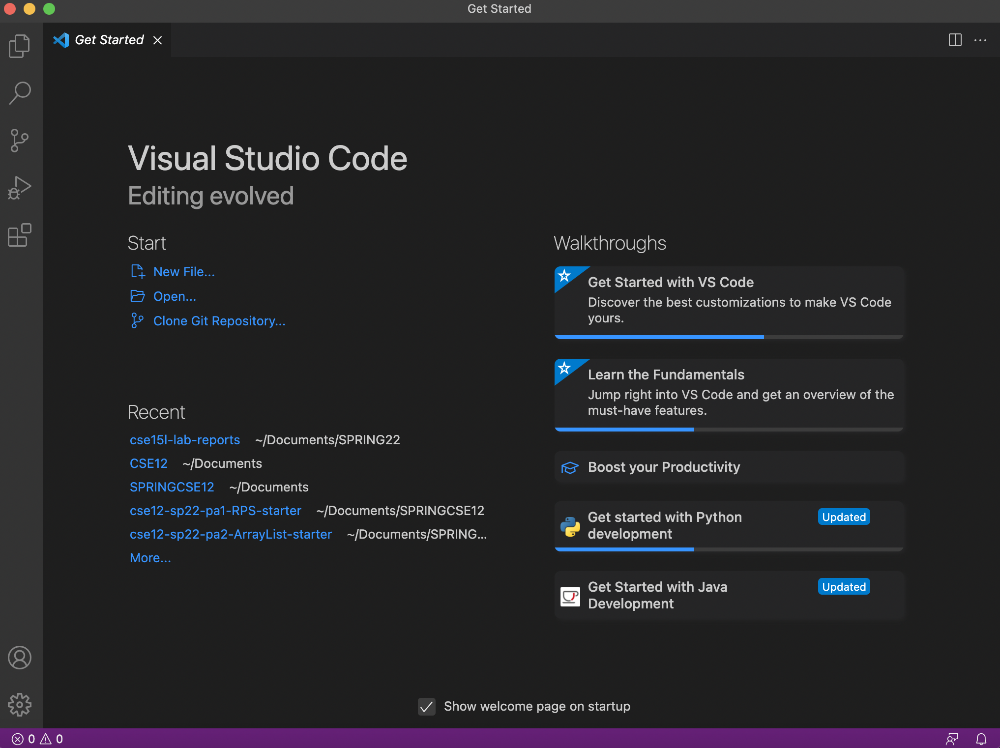
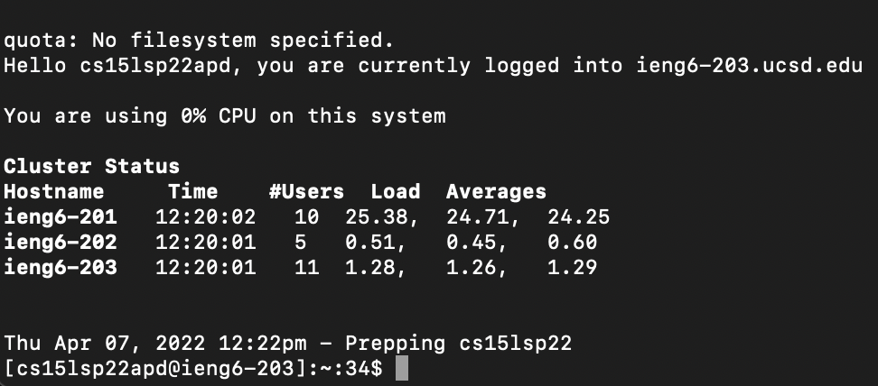
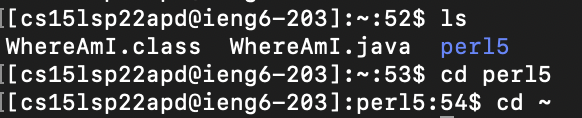
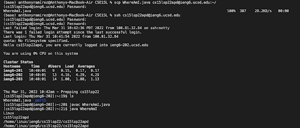

# Lab Report Week 1


---
## Installing VSCode
1. Go to https://code.visualstudio.com/
2. Follow the instructions for your OS

Your fresh install should open up a window like this:



---
## Remotely Connecting
1. Install [OpenSSH](https://docs.microsoft.com/en-us/windows-server/administration/openssh/openssh_install_firstuse)
2. Open a Terminal in VSCode using Terminal > New Terminal
3. Enter the command ```ssh cs15lsp22!!!@ieng6@ucsd.edu``` where the `!!!` are replaced with your letters for your account.
4. If you have set up your account password properly, you should see a message in the terminal that looks like this:


***You are now connected into the server remotely!***

--- 
## Trying Commands
There are a number of different commands you can use to navigate and manipulate the file system on the server. The following are a few along with what they do. **Note**: These commands go into the terminal, after the `$` symbol.

1. `cd ~` will take you to the home directory.
2. `cd FILEPATH` will take you to a specific folder/file, where `FILEPATH` is replaced with the path that you want to cd (change directories) to.
3. `ls` will show you a list of every file/folder in the directory you are in.
4. `mkdir NAME` will create a directory in the directory you are currently in where `NAME` is the name of the directory.
5. `touch NAME.EXT` will create a file in the directory you are currently in where `NAME` is the name of the file and `EXT` is the name of the file extension (html, txt, jpg).

Examples of some commands. Notice how the file path changes when using `cd perl5` versus `cd ~`!



***You now know some basic (but very important) commands!***

---
## Moving Files with SCP
Another important command to know is `scp`. You use this command to copy files and other things over into the remote server. **Note**: This command is always run from the client! Use `exit` to exit the remote server.

1. Take note of the name of the file you would like to move from your client to the remote server. 
2. Use the following command to copy it over: <p>`scp FILENAME.EXT cs15lsp22!!!@ieng6.ucsd.edu:~/`
3. For our purposed I am working with a file called WhereAmI.java that pulls some basic information to be displayed. To run this file you would use the command `javac WhereAmI.java` followed by `java WhereAmI`.
4. Doing so gives me the following output:



***You can transfer files from client to server!***

---
## Setting an SSH Key

