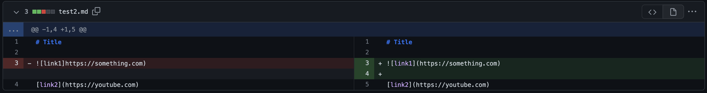

# Lab Report Week 4

---
# Three Code Changes
### *Code Change 1*

This code change was brought about by the following [error](https://github.com/rar001/markdown-parser/commit/b629f4598498a894224d84c5fa2077846d1c7071), where the second changed file used to create an infinite loop when the code ended with any form of text that was not a link. This caused the code to run indefinitely when it got to the end of the file during parsing. Because there was no link at the end of the file, the parser would keep running until it found an open bracket, in which it did not. This caused the program to never stop, and if you changed the file to end at the link text the program would work perfectly.

### *Code Change 2*

This code change was brought about by the following [error](https://github.com/rar001/markdown-parser/commit/7c21b3c6a50db22adbd3f7a271820c7ce99df278), where the output would read `[https://something.com, some-thing.html]`. This is not the correct output because this parser is for links only, not images. It can be seen here that the parser cannot distinguish between link and image formatting. The parser would still filter image formatting as links because it had no code to filter the `!` modifier that creates an image hyperlink. After adding logic to decide if a piece of text was an image or a parenthesis, the program worked.

### *Code Change 3*

This code change was brought about by the following [error](https://github.com/rar001/markdown-parser/commit/9ac3c4ed705f485a1805e8d41e11447bb6c3bee7), where there is not an open parenthesis in the link fornat, creating an improper link format. I could not find a solution using code to account for this, so I opted for just correcting the file being parsed. Some solutions might include proofreading the markdown file before calling the parser, or adding some code to detect whether a link reference meets every condition needed by the parser. The lack of an open parenthesis caused the parser to not know when to start looking for the open parenthesis, which meant it ran indefinitely. This solution was simple, as I just proofread the markdown file and corrected it to work with the parser, although this might not be the most efficient way when working with a larger file with more complex text elements.