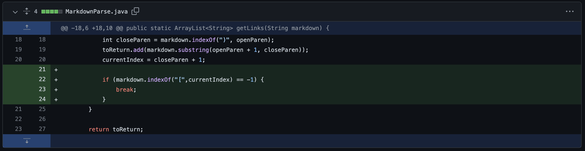
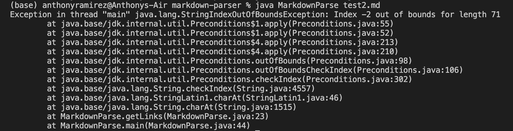
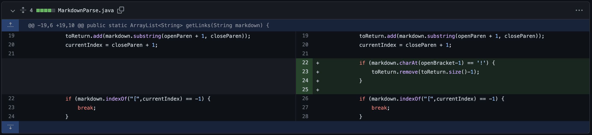
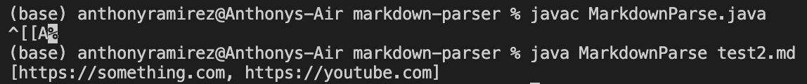
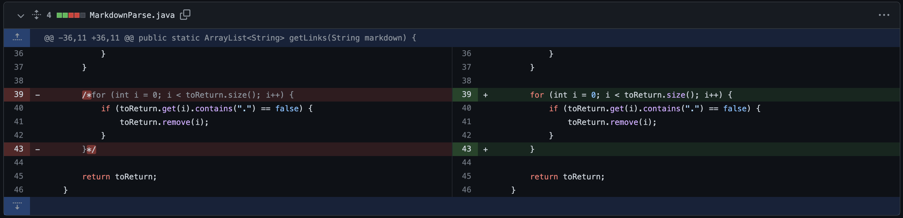

# Lab Report Week 4

---
# Three Code Changes
### *Code Change 1*

This code change was brought about by the following [error](https://github.com/rar001/markdown-parser/commit/b629f4598498a894224d84c5fa2077846d1c7071), where the second changed file used to create an infinite loop when the code ended with any form of text that was not a link. This caused the code to run indefinitely or throw an out of bounds error. when it got to the end of the file during parsing. Because there was no link at the end of the file, the parser would keep running until it found an open bracket, in which it did not. This caused the program to fail, and if you changed the file to end at the link text the program would work perfectly.

Screenshot of Symptom:

### *Code Change 2*

This code change was brought about by the following [error](https://github.com/rar001/markdown-parser/commit/7c21b3c6a50db22adbd3f7a271820c7ce99df278), where the output would read `[https://something.com, some-thing.html]`. This is not the correct output because this parser is for links only, not images. It can be seen here that the parser cannot distinguish between link and image formatting. The parser would still filter image formatting as links because it had no code to filter the `!` modifier that creates an image hyperlink. After adding logic to decide if a piece of text was an image or a parenthesis, the program worked.

Screenshot of Symptom (Wrong Output):

### *Code Change 3*

This code change was brought about by the following [error](https://github.com/rar001/markdown-parser/commit/d4853042e7d9322a484557c28c6b4baaa27cfccd), where there is a valid link format with a piece of text that does not have a link in it, thus it would not link to anything. You can see in the screenshot below that "hey" is not a valid link, yet gets placed inside. After adding logic to check if a link contains the "." char, the program worked as expected.

Screenshot of Symptom (Wrong Output):
