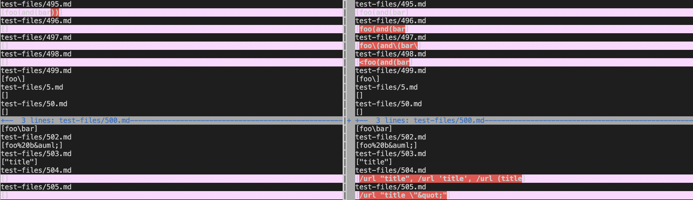
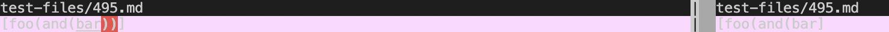
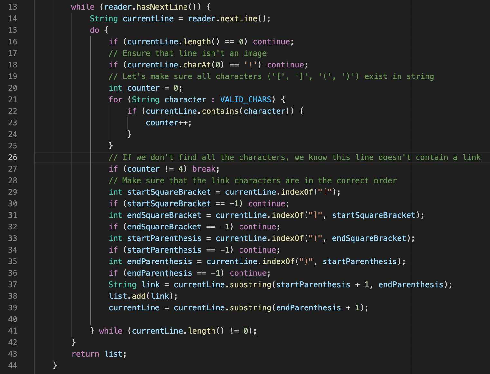
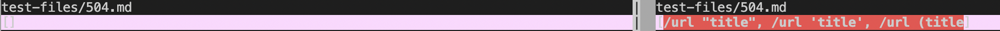
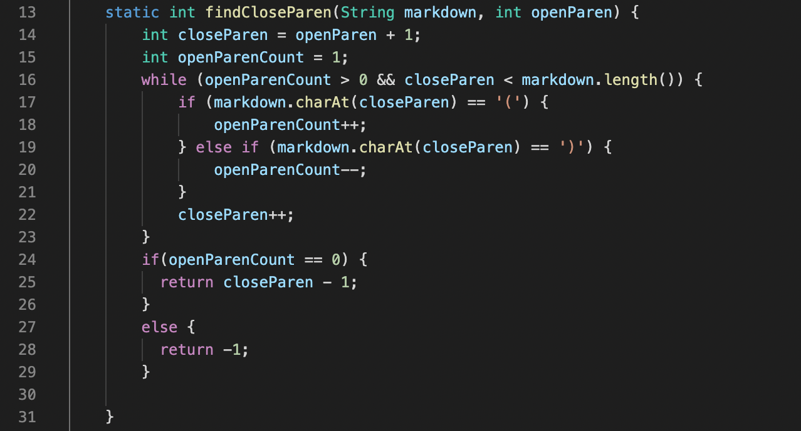
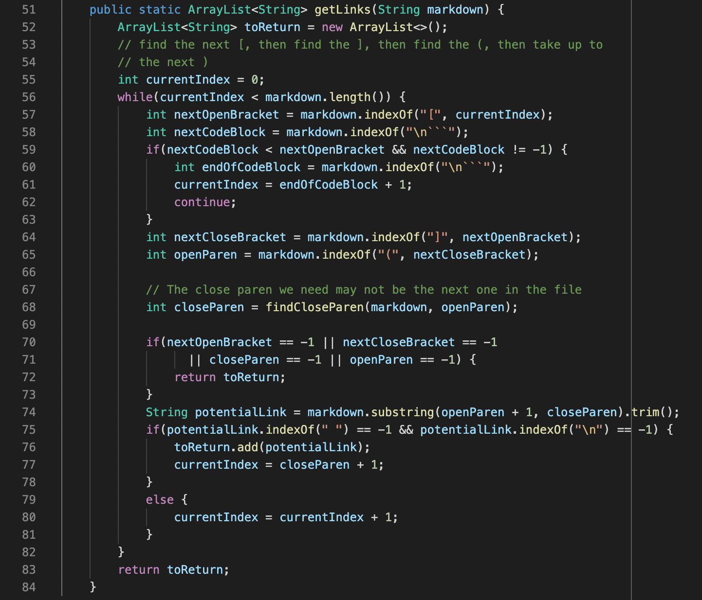

# Lab Report Week 10! The Final Report!

---
## How Did We Find the Different Results?
I used the vimdiff results from running the bash for loop we used in Lab 9 to view and locate two tests that were different between my group's representative repository and the repository given to us during our Lab 9 session. You can see the results here:
 

The tests we will be looking at are test *495.md* and *504.md*.

## Test 1: 495.md

[Test File Repository 495](https://github.com/nidhidhamnani/markdown-parser/edit/main/test-files/495.md)

1. For this test, the correct implementation is the implementation that was provided for us based off of the [CommonMark](https://spec.commonmark.org/dingus/) website, as it collects the link "foo(and(bar))" while our representative implementation fails to grab the last parenthesis, due to an error in how our program collects and includes characters. 
2. The actual outputs using vimdiff, are:

3. The expected output for this file is: `[foo(and(bar))]`

Our incorrect representative implementation is as follows:

I believe the error lies in the fact that this program does not account for extra parenthesis and brackets that may be in the link itself. The extra ")" characters in the link are not being included in the link because at **Line 33**, the endParenthesis variable is assigned as the index value of the first ")" character after the "(" character. This would cause some code confusion when the link contains 3 consecutive ")" characters at the end. This is what I believe to be the problem. A fix for this would be to look for the last ")" character on the line, rather than some arbitrary index for any of them.

---

## Test 2: 504.md

[Test File Repository 504](https://github.com/nidhidhamnani/markdown-parser/edit/main/test-files/504.md)

1. For this test, the correct implementation is our representative implementation *for the most part* based off of the [CommonMark](https://spec.commonmark.org/dingus/) website, as it collects three links while the provided implementation fails to grab any of them. However, both outputs are wrong, ours *slightly*.
2. The actual outputs using vimdiff, are:

3. The expected output for this file is: 

    `[/url "title", /url 'title', /url (title))`.

    *Our representative implementation is only missing that last parenthesis, otherwise it works better than the provided implementation.*

The incorrect provided implementation is as follows:

I believe the issue herelies within the findCloseParen method. I believe that the link conditions cause this method to return a -1, whether it be on **Line 24** or **Line 27**. This then gets passed to the getLinks method where, on **Line 70**, it returns an empty list because the closeParen variable is now equal to -1. I believe this is what is causing the empty list we are seeing in the vimdiff output. I think a fix for this would be a not so concrete final way to return the empty list that toReturn may contain, and to ensure closed parenthesis conditions are tighter and catch every case. Our representative implementation fix would be the same as Test 1's fix above.